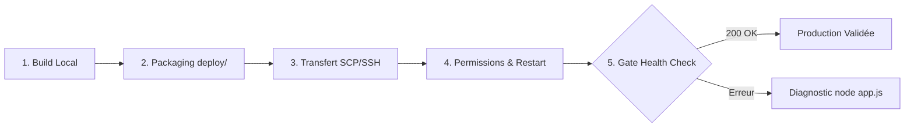

# Expert Déploiement & Télé-maintenance cPanel LWS — Bleadin

Ce skill formalise les standards techniques, les procédures opérationnelles et les outils d'automatisation pour déployer, configurer et maintenir en condition opérationnelle l'application **Bleadin** sur l'infrastructure d'hébergement mutualisée / Cloud **cPanel LWS**.

---

## 1. Mandat & Périmètre d'Intervention

L'expert **`cpanel-lws-expert`** intervient sur les missions suivantes :
1. **Compilation & Packaging :** Production des artefacts optimisés pour le serveur Express (`dist/`), le client Vite (`client/dist/`) et le client Prisma.
2. **Transfert & Synchronisation :** Téléversement automatisé via SSH/SCP ou génération d'archives `.zip` pour le Gestionnaire de fichiers cPanel.
3. **Configuration Runtime :** Paramétrage de Phusion Passenger (`app.js`), des environnements virtuels CloudLinux (`nodevenv`) et des réécritures Apache (`.htaccess`).
4. **Intégrité des Données :** Application du schéma Prisma sur le PostgreSQL local du serveur cPanel (voir Règle 2). En cas de blocage de `prisma db push` (moteur Rust), générer le SQL hors ligne (`npx prisma migrate diff --from-empty --to-schema-datamodel prisma/schema.prisma --script`) et l'appliquer via `psql -f`.
5. **Télé-maintenance & Diagnostic en direct :** Résolution des erreurs 500 masquées par Passenger, extraction de `stderr.log`, correction des permissions `chmod 755` et vérification de santé.

---

## 2. Boîte à Outils CLI (`scripts/cpanel-remote.js`)

Un script utilitaire dédié permet d'orchestrer toutes les opérations locales et distantes en une commande :

| Commande CLI | Script npm raccourci | Description & Action |
|---|---|---|
| `node scripts/cpanel-remote.js build` | `npm run build:server && npm run build:client` | Compile le serveur TypeScript et build l'app Vite. |
| `node scripts/cpanel-remote.js package` | `npm run deploy:package` | Génère `deploy/api/`, `deploy/client/`, `api.zip` et `client.zip`. |
| `node scripts/cpanel-remote.js push` | *(inclus dans deploy-all)* | Synchronise les fichiers vers le serveur cPanel via SCP/SSH. |
| `node scripts/cpanel-remote.js chmod` | `npm run remote:chmod` | Applique les permissions indispensables `chmod -R 755 dist`. |
| `node scripts/cpanel-remote.js restart` | `npm run remote:restart` | Déclenche le rechargement Phusion Passenger (`touch tmp/restart.txt`). |
| `node scripts/cpanel-remote.js logs` | `npm run remote:logs` | Affiche les dernières erreurs enregistrées dans `stderr.log`. |
| `node scripts/cpanel-remote.js diag` | `npm run remote:diag` | Lance `node app.js` directement dans le `nodevenv` pour démasquer les bugs. |
| `node scripts/cpanel-remote.js db-push` | `npm run prisma:migrate` | Applique le schéma Prisma sur la base PostgreSQL locale du serveur (via SSH). |
| `node scripts/cpanel-remote.js health` | `npm run remote:health` | Interroge l'endpoint de santé (`https://api.bleadin.com/api/health`). |
| `node scripts/cpanel-remote.js clean-env` | `npm run remote:clean-env` | Assainit `.env` (suppression garantie du BOM UTF-8 et CRLF). |
| `node scripts/cpanel-remote.js deploy-all`| `npm run deploy:remote` | Exécute le pipeline complet de bout en bout avec vérification. |

---

## 3. Protocole de Déploiement en 5 Phases



### Phase 1 : Build & Validation Pré-déploiement
Toujours valider syntaxiquement le projet avant tout envoi :
```bash
npx prisma validate
npm run build:server
npm --prefix client run build
```

### Phase 2 : Packaging des Artefacts
Générer la structure `deploy/` et les archives de secours :
```bash
node scripts/cpanel-remote.js package
```
*Vérifier que `.env` de production est correctement inclus dans `deploy/api/`.*

### Phase 3 : Transfert & Synchronisation Distante
- **Mode Automatisé :** Via SSH/SCP (`npm run deploy:remote`).
- **Mode Manuel (Secours) :** Consulter le runbook dédié dans `references/runbooks.md`.

### Phase 4 : Rétablissement des Permissions POSIX & Redémarrage
Après un téléversement depuis Windows, les répertoires et fichiers JS compilés doivent impérativement avoir le bit d'exécution :
```bash
# Commande locale automatisée
npm run remote:chmod
npm run remote:restart
```

### Phase 5 : Quality Gate & Validation de Santé
Vérifier que l'API et le frontend répondent avec succès :
```bash
npm run remote:health
```

---

## 4. Protocole de Télé-Maintenance & Diagnostic Rapide

### Démasquage d'une Erreur 500 Passenger
Phusion Passenger masque fréquemment les erreurs réelles derrière une page d'erreur générique.  
Pour obtenir immédiatement le log d'erreur complet et la stack trace :

```bash
# 1. Option A : Lancer le diagnostic à distance depuis la machine locale
npm run remote:diag

# 2. Option B : En direct dans le terminal SSH cPanel
source ~/nodevenv/public_html/api-bleadin/24/bin/activate
cd ~/public_html/api-bleadin
node app.js
```
*Le serveur démarrera en mode interactif et affichera en plein écran la cause du blocage (ex: variable d'environnement manquante, erreur de syntaxe, rejet de connexion DB).*

### Consultation des Logs Serveur
```bash
npm run remote:logs
```

---

## 5. Règles Critiques & Règles d'Or Inviolables

1. **Règle de Parité Stricte Prisma :** `@prisma/client`, `@prisma/adapter-neon` (ou `@prisma/adapter-pg`) et `prisma` DOIVENT TOUJOURS avoir la version exacte identique au patch près (ex: `6.19.3`). Toute disparité provoque des `TypeError: Cannot read properties of undefined (reading 'bind')` ou des ruptures de contrat Driver Adapter.
2. **Règle Base de Données : PostgreSQL LOCAL LWS (vérifié en production le 10/09/2026).**
   La base tourne sur le serveur cPanel lui-même, joignable en TCP standard `127.0.0.1:5432`, **sans SSL**. Neon n'est plus utilisé et n'est plus nécessaire.
   - Chaîne de connexion : `postgresql://<user>:<pass>@127.0.0.1:5432/<db>` (aucun `sslmode` : le Postgres LWS ne supporte pas SSL).
   - ⚠️ **Une base cPanel n'est joignable qu'après rattachement d'un utilisateur** : `uapi Postgresql grant_all_privileges user='<user>' database='<db>'`. Sans ce rattachement, cPanel n'écrit aucune entrée dans `pg_hba.conf` et la connexion est refusée avec le message trompeur `no pg_hba.conf entry for host ... SSL off`, quels que soient les identifiants.
   - ⚠️ **Vérifier l'absence d'espace dans le nom de la base** (`uapi Postgresql list_databases`). Une base nommée `c2862963c_ bleadin_db` (avec espace) produit exactement la même erreur trompeuse — c'est ce qui avait fait conclure à tort, support LWS inclus, que « l'accès externe était désactivé ».
   - Les droits DDL sont bien accordés : `CREATE TABLE`, `CREATE TYPE` (enums) et `transaction_read_only = off` ont tous été vérifiés.

3. **Règle Bridage des Threads Prisma (CloudLinux LVE) — INVIOLABLE :** Positionner `TOKIO_WORKER_THREADS=2` et `UV_THREADPOOL_SIZE=2` **avant** toute instanciation de Prisma (fait dans `lib/prisma.ts` ET `env.js`).
   Le moteur Rust de Prisma dimensionne son pool Tokio sur le nombre de cœurs visibles (**30** ici), alors que CloudLinux plafonne le compte à **~33 threads** au total. Sans bridage : `EAGAIN` à la création des threads, mort du thread `futures-timer`, panique `timer has gone away`, puis **blocage infini de toute requête base sans erreur applicative exploitable**.
   Symptôme piégeux : `psql` et le driver `pg` brut continuent de fonctionner parfaitement — seul Prisma se fige. Diagnostic rapide : `nproc` (cœurs visibles) puis test de création de threads Node.
3. **Règle d'Assainissement `.env` Cross-Platform (BOM UTF-8 & CRLF) :** Ne jamais se fier aux commandes `sed` pour supprimer les BOM UTF-8 Windows (`\xEF\xBB\xBF`). Utiliser toujours un script Node.js (`node scripts/cpanel-remote.js clean-env`) pour purger `.env`. Dans le code applicatif (`lib/prisma.ts`), implémenter systématiquement une lecture défensive multi-clés (`process.env.DATABASE_URL || process.env["\uFEFFDATABASE_URL"]`).
4. **Règle des Permissions Linux :** Tout dossier extrait ou copié depuis Windows doit recevoir un `chmod -R 755 dist` sous peine d'erreur `Cannot find module './dist/server/src/index.js'`.
5. **Règle des Variables d'Environnement :** Le fichier `.env` de l'API sur le serveur cPanel doit contenir des clés sécurisées et les URLs exactes (sans slash de fin) :
   - `FRONTEND_URL=https://app.bleadin.com`
   - `SELF_PING_URL=https://api.bleadin.com/api/health`
6. **Règle Git :** Le fichier `.env.deploy` contenant les accès SSH distants ne doit JAMAIS être poussé sur GitHub.

---

## 6. Documents de Référence Détaillés

Pour approfondir des scénarios complexes, consulter les ressources annexées :
- Architecture LWS, CloudLinux & Passenger : [`references/cpanel-lws-guide.md`](file:///c:/Projets/linkedin-app/.agents/skills/cpanel-lws-expert/references/cpanel-lws-guide.md)
- Matrice de résolution d'incidents : [`references/troubleshooting.md`](file:///c:/Projets/linkedin-app/.agents/skills/cpanel-lws-expert/references/troubleshooting.md)
- Runbooks d'urgence pas-à-pas : [`references/runbooks.md`](file:///c:/Projets/linkedin-app/.agents/skills/cpanel-lws-expert/references/runbooks.md)
