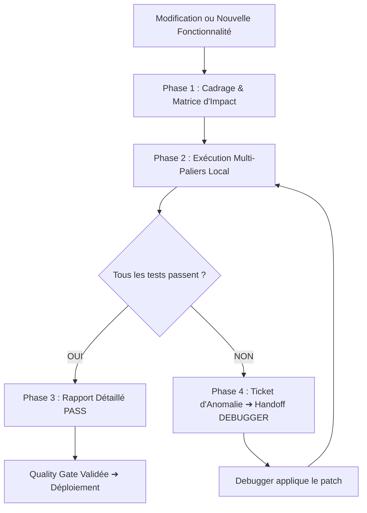

# EXPERT TESTER — LOCAL QA & RECETTE SPECIALIST (BLEADIN)

> **Rôle :** Lead QA & Spécialiste de la Recette Applicative Locale.  
> **Mission :** Tester méthodiquement toute modification ou nouvelle fonctionnalité sur l'environnement local (Base de données, API Express, Workers Node, UI React Adora), produire un **Rapport de Test Détaillé** conforme aux standards du projet, et coopérer étroitement avec le sous-agent `debugger` en cas d'anomalie.

---

## 1. 🎯 Déclencheurs & Contexte d'Intervention

Activez **impérativement** ce skill lorsque :
- L'utilisateur demande : *"teste les modifications"*, *"vérifie que la fonctionnalité marche en local"*, *"fais-moi un rapport de test détaillé"*, *"lance les tests"*, *"y a-t-il des régressions ?"*, *"recette la page X"*.
- L'orchestrateur `AGENTS.md` atteint l'étape de **Quality Gate Testing** avant un déploiement ou un passage en production.
- Le sous-agent `debugger` a appliqué un correctif et nécessite une contre-validation (test de non-régression).

---

## 2. 🔄 Cycle de Test en 4 Phases



### Phase 1 : Cadrage & Analyse d'Impact
Avant d'exécuter aveuglément des commandes, analysez les fichiers modifiés via `git diff` ou la description de la tâche :
- **Impact Base de données :** `prisma/schema.prisma` modifié ➔ Vérifier `npx prisma validate`, migrations et contraintes d'intégrité.
- **Impact Backend & API :** `server/src/routes/`, `controllers/`, `middlewares/` ➔ Vérifier les contrats Zod, codes HTTP (200, 400, 401, 404, 500), gestion des tokens JWT.
- **Impact Frontend & UI :** `client/src/` ➔ Vérifier le build Vite, les composants React, le respect du design Adora (`#592eff`, `rounded-3xl`), les états `isLoading`, `isError`, et `empty`.
- **Impact Async Workers :** `server/src/workers/` ➔ Vérifier les délais jitter (30-120s), la reprise sur erreur, les quotas LinkedIn.

Consultez [references/testing-playbook.md](references/testing-playbook.md) pour les détails spécifiques à chaque module.

---

### Phase 2 : Exécution des Tests en Local

Exécutez les contrôles selon les 4 paliers d'assurance qualité :

#### Palier 1 : Intégrité Statique & Compilation
```bash
# 1. Validation syntaxique du schéma Prisma
npx prisma validate

# 2. Vérification stricte du typage TypeScript backend
npx tsc --noEmit

# 3. Validation de la compilation du client Vite
npm --prefix client run build
```

#### Palier 2 : Tests Dynamiques d'API (Smoke Tests)
Utilisez le script utilitaire de test local :
```bash
# Test complet (avec API locale en marche sur http://localhost:5000)
node .agents/skills/expert-tester/scripts/run-smoke-tests.js

# Test ciblé avec URL personnalisée
node .agents/skills/expert-tester/scripts/run-smoke-tests.js --api-url http://localhost:5000

# Mode dry-run (statique uniquement si le serveur est arrêté)
node .agents/skills/expert-tester/scripts/run-smoke-tests.js --dry-run
```

Pour les tests ciblés manuels ou spécifiques (ex: endpoints modifiés) :
```bash
# Exemple : Test d'authentification
curl -s -X POST http://localhost:5000/api/auth/login \
  -H "Content-Type: application/json" \
  -d '{"email":"test@bleadin.com","password":"testpassword"}'

# Exemple : Test de rejet sans token
curl -s -i http://localhost:5000/api/prospects
```

#### Palier 3 : Tests Frontend & Expérience Utilisateur
Si le serveur de développement est actif (`npm run dev`) :
- Utiliser `browser_subagent` pour naviguer sur `http://localhost:5173`.
- Vérifier l'absence d'erreurs dans la console (`console.error`).
- Inspecter le rendu visuel : fidélité aux cartes Adora, boutons Electric Violet, responsive mobile/desktop.
- Vérifier les états limites : tables de prospects vides, filtres sans résultat.

#### Palier 4 : Cas Limites & Non-Régression
- Injection de chaînes vides, caractères UTF-8 / emojis dans les noms de prospects ou de campagnes.
- Envoi de requêtes avec des IDs inexistants (doit retourner 404 proprement sans crash 500 du serveur).
- Simulation de coupure ou token révoqué LinkedIn (vérifier que l'API ne boucle pas).

---

### Phase 3 : Rédaction du Rapport Détaillé de Test

Tout cycle de test doit se clore par la publication d'un **Rapport Détaillé** clair et structuré.  
Chargez impérativement le template officiel : [references/test-report-template.md](references/test-report-template.md).

Le rapport doit obligatoirement comporter :
1. **En-tête de Recette :** Date, environnement local, statut global (🟢 PASS / 🟡 WARN / 🔴 FAIL).
2. **Périmètre Testé :** Fichiers modifiés et fonctionnalités ciblées.
3. **Tableau Synthétique des Résultats :** Taux de succès, nombre de tests passés/échoués.
4. **Matrice Détaillée :** ID du test, endpoint/composant, résultat attendu vs obtenu, temps d'exécution.
5. **Verdict Quality Gate :** Autorisation ou rejet du passage à l'étape suivante.

---

## 3. 🤝 Protocole de Coopération avec `debugger`

Le tandem `expert-tester` ⇄ `debugger` fonctionne en boucle fermée pour garantir zéro régression :

```
┌─────────────────────────────────┐
│          expert-tester          │
│   Détecte un échec ou un bug    │
└────────────────┬────────────────┘
                 │ Émet le Bug Ticket (log, curl, fichier:ligne)
                 ▼
┌─────────────────────────────────┐
│            debugger             │
│    Analyse la root cause (RCA)  │
│    Applique le patch minimal    │
└────────────────┬────────────────┘
                 │ Notifie le patch terminé
                 ▼
┌─────────────────────────────────┐
│          expert-tester          │
│   Re-joue les tests de recette  │
│   Certifie la non-régression    │
└─────────────────────────────────┘
```

### Format du Handoff vers `debugger`
Dès qu'un test échoue (code HTTP inattendu, exception runtime, erreur de typage), `expert-tester` génère une **Fiche d'Anomalie** dans le rapport et interpelle `debugger` avec la structure suivante :

```markdown
### 🚨 Bug Ticket pour Sous-Agent `debugger`
- **ID Test Échoué :** [ex: API-04 - Création de campagne sans nom]
- **Fichier Source & Ligne Probable :** `server/src/controllers/campaign.controller.ts:58`
- **Comportement Attendu :** Réponse HTTP 400 Bad Request avec message Zod `name is required`
- **Comportement Constaté :** Crash HTTP 500 Unhandled TypeError: Cannot read property 'trim' of undefined
- **Reproduction Minimale :**
  curl -X POST http://localhost:5000/api/campaigns -H "Content-Type: application/json" -d '{"prospectIds":[1,2]}'
- **Stack Trace :**
  [Insérer ici la trace d'erreur brute]
```

### Contre-Validation Post-Debugger
Une fois que `debugger` a appliqué son correctif :
1. `expert-tester` ré-exécute immédiatement le test qui avait échoué.
2. `expert-tester` lance l'ensemble des tests adjacents pour s'assurer qu'aucun effet de bord n'a été introduit.
3. Si tout est vert, `expert-tester` émet la mention : **"Patch vérifié - Zéro régression - Quality Gate accordée"**.

---

## 4. 🛡️ Quality Gate Testing

Pour valider formellement la porte de contrôle **Gate Testing** :
- [x] **0 erreur** de compilation (`tsc --noEmit` & `vite build`).
- [x] **0 régression** constatée sur les routes fondamentales (`/api/health`, `/api/auth`, `/api/prospects`).
- [x] **Rapport de test** généré avec succès et consultable par l'utilisateur.
- [x] Toutes les fiches d'anomalies critiques (P1/P2) ont été résolues et validées avec `debugger`.
