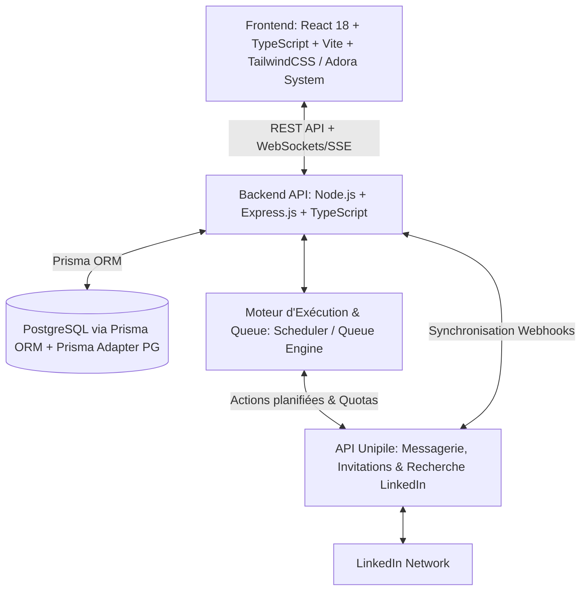

# CAHIER DES CHARGES TECHNIQUE & FONCTIONNEL
# 🚀 Projet : BIME LINK — Plateforme d'Automatisation & Prospection LinkedIn

---

## 1. PRÉSENTATION GÉNÉRALE DU PROJET

### 1.1 Vision & Objectif
**Bime Link** est une application web SaaS tout-en-un d'automatisation de prospection LinkedIn (inspirée de **Waalaxy**), dotée d'une interface ultra-premium (design system *Adora*). 

Elle permet aux professionnels, équipes commerciales, agences et recruteurs de :
- Lancer des **campagnes de prospection multi-étapes** automatisées (Demande de connexion avec/sans note + relances conditionnelles avec délais).
- Constituer et segmenter des **listes de prospects** qualifiés via recherche ciblée LinkedIn ou import Excel/CSV.
- Suivre en temps réel les **performances & statistiques** de conversion (taux d'acceptation, taux de réponse, file d'attente, gestion des quotas).
- Gérer toutes les conversations issues de la prospection au sein d'une **Inbox synchronisée** directement avec LinkedIn en temps réel via l'API **Unipile**.

---

## 2. ARCHITECTURE TECHNIQUE & STACK



### 2.1 Stack Technologique
| Couche | Technologie | Justification & Rôle |
|---|---|---|
| **Frontend** | **React 18 / 19 + TypeScript + Vite** | SPA réactive, typage strict, bundling ultra-rapide. |
| **Design / Styling** | **Tailwind CSS v4 + Vanilla CSS Tokens** | Implémentation fidèle du système *Adora* (`DESIGN (2).md`), tokens HSL, bordures douces (40-64px), Electric Violet `#592eff`. |
| **Composants & Visuals** | **Lucide Icons + Recharts + Sonner + Base-UI** | Graphiques d'analytics, micro-animations, notifications toasts et modales fluides. |
| **Backend** | **Node.js + Express.js + TypeScript** | Architecture RESTful en couches (Controllers, Services, Repositories). |
| **ORM & Database** | **Prisma ORM + PostgreSQL** (Prisma Postgres / `@prisma/adapter-pg`) | Typage automatique de la base, migrations déclaratives, performances optimales. |
| **API Provider LinkedIn** | **Unipile API** (`https://developer.unipile.com/`) | Gestion sécurisée des comptes LinkedIn (invitations, messages, profils, webhooks, synchronisation sans extension Chrome requise). |
| **Gestion des Tâches / Queue** | **Node Cron / Action Queue Manager** | Planification des étapes, jitter anti-détection (délais aléatoires), respect des quotas (ex: max 100-200 invits/semaine). |

---

## 3. SPÉCIFICATIONS FONCTIONNELLES DÉTAILLÉES

### Module 1 : Dashboard (Tableau de Bord & Centre de Contrôle)
Inspiré de l'accueil de Waalaxy avec l'esthétique Adora :
1. **Header Profil & Statut :**
   - Nom d'utilisateur, photo de profil synchronisée LinkedIn, badge de plan/crédits restants.
   - Sélecteur de période temporelle (*7 derniers jours, 30 derniers jours, Ce mois, Global*).
   - Sélecteur de portée (*Mes campagnes / Campagnes de l'équipe*).
2. **Indicateurs Clés de Performance (KPIs) :**
   - **LinkedIn Engagement :** Nombre de réponses aux messages + Taux de réponse global (%).
   - **Taux d'acceptation :** Nombre d'invitations acceptées + Taux d'acceptation (%).
   - **Statut de prospection :** Nombre de campagnes actives, total des actions en file d'attente (Actions en attente).
   - **Enrichissement Email :** Emails professionnels trouvés + Taux d'enrichissement.
3. **Graphique d'activité temporelle :**
   - Courbe d'évolution quotidienne des invitations envoyées, acceptées, et des messages répondus.
4. **Jauge de Quotas Anti-Ban :**
   - Visualisation de la limite journalière/hebdomadaire LinkedIn (ex. 25/30 invitations envoyées aujourd'hui).

---

### Module 2 : Gestion des Prospects & Listes (CRM de Prospection)
1. **Système de Listes (Dossiers) :**
   - Création, renommage, suppression et organisation par catégories (ex: *DG Côte d'Ivoire, Directeurs Commerciaux, Tech Leads*).
   - Vue "Tous les prospects" et vue par liste ciblée avec compteur de prospects par liste.
2. **Sources d'Alimentation des Prospects :**
   - **Recherche LinkedIn intégrée (via Unipile Search API) :** Mots-clés, Titre de poste, Entreprise, Localisation, Industrie, Taille d'entreprise.
   - **Import Fichier Excel / CSV :** Mapping intelligent des colonnes (*Nom, Prénom, URL LinkedIn, Poste, Entreprise, Email, Téléphone*).
   - **Ajout manuel / Direct :** Saisie d'une URL de profil LinkedIn.
3. **Tableau & Fiches Prospects :**
   - Colonnes : *Sélection (checkbox), Avatar, Nom & Prénom, Titre de poste, Entreprise, Campagne associée, Email pro / Statut, État (Connecté, En attente, Non contacté), Actions rapides*.
   - Filtres multi-critères : Statut d'invitation, État du message, Présence d'email, Tags, Campagne active.
   - Actions groupées : *Ajouter à une campagne, Déplacer de liste, Enrichir email, Exporter en CSV, Marquer "Ne pas contacter" / Blacklist*.

---

### Module 3 : Moteur de Campagnes & Automatisation de Séquences
1. **Gestion des Campagnes :**
   - Vues par onglets : *En cours, En pause, Brouillon, Archivée*.
   - Cartes de campagnes avec statut coloré, nombre de prospects inscrits, taux de conversion et bouton d'action rapide.
2. **Workflow Builder (Éditeur de Séquence Étape par Étape) :**
   - **Étape 1 — Sélection des prospects :** Choix d'une ou plusieurs listes de prospects.
   - **Étape 2 — Demande de connexion :** Avec ou sans note personnalisée (variables : `{{firstName}}`, `{{lastName}}`, `{{company}}`).
   - **Étape 3 — Condition d'acceptation & Délai :** Attente de l'acceptation de la connexion (délai paramétrable : ex. 1 à 15 jours).
   - **Étape 4 — Message 1 (Relance) :** Envoi automatique dès validation de la connexion.
   - **Étape 5 — Condition de réponse & Délai 2 :** Si le prospect répond, la campagne **s'arrête automatiquement** pour ce prospect (sortie positive) et bascule vers l'Inbox.
   - **Étape 6 — Message 2 / Message 3 :** Relances successives paramétrables avec délais espacés.
3. **Suivi Détaillé de la Campagne (Vue Dédiée) :**
   - **Onglet Prospects de la campagne :**
     - Classification automatique des prospects :
       - *En attente d'une condition* (ex: attend que le prospect accepte la connexion).
       - *Différés / En attente de délai* (ex: délai de 2 jours en cours avant le message 1).
       - *Sortis / Terminés* (Campagne terminée avec succès ou sans réponse).
       - *Répondus* (Prospect ayant répondu -> transféré à l'Inbox).
   - **Onglet Statistiques :** Taux de passage d'étape en étape, funnel d'entonnoir complet.

---

### Module 4 : Messagerie Synchronisée (Inbox LinkedIn)
1. **Synchronisation Bidirectionnelle LinkedIn (via Unipile API) :**
   - Réception instantanée des messages reçus via Webhooks Unipile.
   - Envoi de messages depuis Bime Link directement transmis sur la boîte de réception LinkedIn du prospect.
2. **Interface de Chat & Gestion des Conversations :**
   - Volet gauche : Liste des conversations récentes avec avatar, nom, dernier message, badge non-lu, tag de campagne.
   - Volet central : Fil de discussion chronologique, statut d'envoi/lecture, zone de saisie enrichie avec templates de réponses rapides.
   - Volet droit (Mini-CRM Prospect) : Fiche détaillée du prospect (poste, entreprise, historique des étapes de campagne franchies, notes internes, lien profil LinkedIn direct).

---

### Module 5 : Intégration Unipile & Sécurité Anti-Ban
1. **Connexion de Compte LinkedIn :**
   - Utilisation du flux Unipile Hosted Auth Link ou API Direct Connect pour lier le compte LinkedIn de l'utilisateur.
   - Stockage chiffré de l'Identifiant de compte Unipile (`unipile_account_id`).
2. **Règles Anti-Ban & Algorithme de Sécurité :**
   - **Quotas Journaliers :** Limitation configurable (ex: 20-30 invitations / jour, 50-80 messages / jour).
   - **Jitter Aléatoire :** Espacement aléatoire des requêtes (ex: entre 80s et 240s entre deux actions) pour imiter un comportement humain.
   - **Horaires de prospection :** Exécution des actions uniquement durant les plages horaires de bureau configurées par l'utilisateur (ex: Lun-Ven, 09h00 - 18h30).
   - **Arrêt d'urgence :** Mise en pause immédiate des campagnes en cas d'erreur de checkpoint LinkedIn / alerte Unipile.

---

## 4. MODÈLE DE DONNÉES PRISMA (PostgreSQL)

```prisma
datasource db {
  provider = "postgresql"
  url      = env("DATABASE_URL")
}

generator client {
  provider = "prisma-client-js"
}

enum CampaignStatus {
  DRAFT
  ACTIVE
  PAUSED
  COMPLETED
  ARCHIVED
}

enum ProspectStepStatus {
  PENDING
  WAITING_CONDITION
  WAITING_DELAY
  IN_PROGRESS
  REPLIED
  COMPLETED
  FAILED
}

enum ActionType {
  INVITATION
  MESSAGE
  VISIT_PROFILE
  DELAY
}

model User {
  id               String            @id @default(uuid())
  email            String            @unique
  name             String?
  avatarUrl        String?
  role             String            @default("USER")
  createdAt        DateTime          @default(now())
  updatedAt        DateTime          @updatedAt

  accounts         LinkedInAccount[]
  prospectLists    ProspectList[]
  campaigns        Campaign[]
  messageTemplates MessageTemplate[]
}

model LinkedInAccount {
  id               String            @id @default(uuid())
  userId           String
  user             User              @relation(fields: [userId], references: [id], onDelete: Cascade)
  unipileAccountId String            @unique
  accountName      String?
  profilePicture   String?
  headline         String?
  status           String            @default("CONNECTED") // CONNECTED, DISCONNECTED, CHECKPOINT
  dailyInvitesSent Int               @default(0)
  maxDailyInvites  Int               @default(30)
  dailyMsgSent     Int               @default(0)
  maxDailyMsg      Int               @default(70)
  createdAt        DateTime          @default(now())
  updatedAt        DateTime          @updatedAt

  campaigns        Campaign[]
  actionQueues     ActionQueue[]
}

model ProspectList {
  id          String        @id @default(uuid())
  userId      String
  user        User          @relation(fields: [userId], references: [id], onDelete: Cascade)
  name        String
  description String?
  color       String?       @default("#592eff")
  createdAt   DateTime      @default(now())
  updatedAt   DateTime      @updatedAt

  prospects   Prospect[]
}

model Prospect {
  id                String            @id @default(uuid())
  listId            String
  list              ProspectList      @relation(fields: [listId], references: [id], onDelete: Cascade)
  linkedinUrl       String
  providerProfileId String?
  firstName         String
  lastName          String
  headline          String?
  company           String?
  location          String?
  email             String?
  phone             String?
  avatarUrl         String?
  connectionStatus  String            @default("NOT_CONNECTED") // NOT_CONNECTED, PENDING, CONNECTED
  tags              String[]          @default([])
  doNotContact      Boolean           @default(false)
  createdAt         DateTime          @default(now())
  updatedAt         DateTime          @updatedAt

  campaignStates    ProspectCampaignState[]
  conversations     Conversation[]
}

model Campaign {
  id                String            @id @default(uuid())
  userId            String
  user              User              @relation(fields: [userId], references: [id], onDelete: Cascade)
  accountId         String?
  linkedInAccount   LinkedInAccount?  @relation(fields: [accountId], references: [id], onDelete: SetNull)
  name              String
  status            CampaignStatus    @default(DRAFT)
  type              String            @default("INVITATION_AND_MESSAGES")
  createdAt         DateTime          @default(now())
  updatedAt         DateTime          @updatedAt

  steps             CampaignStep[]
  prospectStates    ProspectCampaignState[]
}

model CampaignStep {
  id          String        @id @default(uuid())
  campaignId  String
  campaign    Campaign      @relation(fields: [campaignId], references: [id], onDelete: Cascade)
  stepOrder   Int
  actionType  ActionType
  delayDays   Int           @default(0)
  messageText String?
  createdAt   DateTime      @default(now())

  prospectStates ProspectCampaignState[]
}

model ProspectCampaignState {
  id             String             @id @default(uuid())
  campaignId     String
  campaign       Campaign           @relation(fields: [campaignId], references: [id], onDelete: Cascade)
  prospectId     String
  prospect       Prospect           @relation(fields: [prospectId], references: [id], onDelete: Cascade)
  currentStepId  String?
  currentStep    CampaignStep?      @relation(fields: [currentStepId], references: [id], onDelete: SetNull)
  status         ProspectStepStatus @default(PENDING)
  nextExecutionAt DateTime?
  lastActionAt   DateTime?
  errorLog       String?
  createdAt      DateTime           @default(now())
  updatedAt      DateTime           @updatedAt

  @@unique([campaignId, prospectId])
}

model ActionQueue {
  id             String          @id @default(uuid())
  accountId      String
  linkedInAccount LinkedInAccount @relation(fields: [accountId], references: [id], onDelete: Cascade)
  prospectId     String
  campaignId     String
  actionType     ActionType
  payload        Json
  scheduledFor   DateTime
  status         String          @default("QUEUED") // QUEUED, EXECUTING, SUCCESS, FAILED
  executedAt     DateTime?
  errorMessage   String?
  createdAt      DateTime        @default(now())
}

model Conversation {
  id                String       @id @default(uuid())
  prospectId        String
  prospect          Prospect     @relation(fields: [prospectId], references: [id], onDelete: Cascade)
  unipileChatId     String?      @unique
  lastMessageText   String?
  lastMessageAt     DateTime?
  unreadCount       Int          @default(0)
  createdAt         DateTime     @default(now())
  updatedAt         DateTime     @updatedAt

  messages          Message[]
}

model Message {
  id                String       @id @default(uuid())
  conversationId    String
  conversation      Conversation @relation(fields: [conversationId], references: [id], onDelete: Cascade)
  unipileMessageId  String?      @unique
  senderType        String       // USER ou PROSPECT
  text              String
  sentAt            DateTime     @default(now())
}

model MessageTemplate {
  id        String   @id @default(uuid())
  userId    String
  user      User     @relation(fields: [userId], references: [id], onDelete: Cascade)
  title     String
  content   String
  createdAt DateTime @default(now())
}
```

---

## 5. DESIGN SYSTEM "ADORA" & EXPÉRIENCE UTILISATEUR

Conformément à la spécification de marque [`DESIGN (2).md`](file:///c:/Projets/linkedin-app/DESIGN%20(2).md) :

### 5.1 Palette Chromatique & Rôles
- **Couleur d'Action Principale :** `Electric Violet` (`#592eff`) — Boutons CTA principaux, états actifs, jauges de progression.
- **Titres & Textes d'Impact :** `Midnight Plum` (`#21164c`) — Typographie d'en-tête, contraste premium.
- **Corps de texte & Neutres :** `Obsidian Charcoal` (`#353241`) & `Slate Smoke` (`#5f5f69`).
- **Surfaces & Cartes :** `Pure White` (`#ffffff`) sur fond canvas léger avec séparateurs capillaires `Pearl Mist` (`#e0e0db`).
- **Accents Décoratifs & Badges :** `Neon Cyan` (`#2ed6ff`), `Lime Pop` (`#a2ea13`), `Cotton Candy` (`#ffaae6`), `Magenta Pulse` (`#f843c2`).

### 5.2 Géométrie & Composants Clés
- **Rayons de courbure généreux :** Cartes de 40px, cadres de prévisualisation de 64px, badges pills de 200px, boutons d'action de 8-12px.
- **Top Navigation Pill :** Barre de navigation flottante blanche en forme de capsule (rayon 40px) avec logo spiralé violet, liens de menus et bouton d'action rapide *"Démarrer une campagne"*.
- **Workflow Stepper Vertical :** Timeline verticale à gauche de l'éditeur de campagne avec icônes de type d'action et connecteurs visuels.

---

## 6. ENDPOINTS API EXPRESS & INTÉGRATION UNIPILE

### 6.1 Endpoints Backend (Express.js)
- `GET /api/dashboard/stats` : Récupère les métriques consolidées (réponses, acceptations, quotas, actions en file).
- `GET /api/prospect-lists` & `POST /api/prospect-lists` : CRUD des listes de prospects.
- `GET /api/prospects` & `POST /api/prospects/import-csv` : Filtrage, pagination et importation de prospects.
- `POST /api/prospects/search-linkedin` : Lancement d'une recherche LinkedIn via Unipile.
- `GET /api/campaigns` & `POST /api/campaigns` : CRUD des campagnes et de leurs étapes (steps).
- `POST /api/campaigns/:id/toggle-status` : Démarrage, mise en pause ou reprise d'une campagne.
- `GET /api/campaigns/:id/prospects` : Liste des prospects associés à une campagne avec statut d'étape.
- `GET /api/inbox/conversations` & `GET /api/inbox/conversations/:id/messages` : Liste et détails des conversations.
- `POST /api/inbox/messages/send` : Envoi direct d'un message via Unipile.
- `POST /api/webhooks/unipile` : Réception des événements Unipile (nouveau message entrant, invitation acceptée).

### 6.2 Appels API Unipile Spécifiques
- **Connexion de compte :** `POST /api/v1/hosted/accounts/link`
- **Recherche de profils :** `POST /api/v1/users/search`
- **Envoi de demande de connexion :** `POST /api/v1/users/invite`
- **Envoi de message LinkedIn :** `POST /api/v1/chats` ou `POST /api/v1/chats/{chat_id}/messages`
- **Récupération des relations :** `GET /api/v1/users/relations`

---

## 7. FEUILLE DE ROUTE D'IMPLÉMENTATION (ROADMAP)

1. **Phase 1 : Initialisation & Socle Données / Backend**
   - Mise en place du projet (Vite + React + Express + TypeScript).
   - Intégration de Prisma avec PostgreSQL (`db_cmtczc7se715l3rdvsubwlrdu`) selon les règles strictes.
   - Déploiement des migrations initiales et seeds.
2. **Phase 2 : Design System & Layout Global**
   - Implémentation du Design System Adora (CSS Tokens, Typo, Layouts, Navigation Pill, Sidebar, Badges, Modales).
3. **Phase 3 : Dashboard & Gestion des Prospects**
   - Écran Dashboard avec KPIs dynamiques et graphiques Recharts.
   - Module Prospects (Listes, Tableaux avec filtres, import CSV/Excel, modale d'import LinkedIn).
4. **Phase 4 : Moteur de Campagnes & Séquenceur**
   - Liste des campagnes (En cours, En pause, Archivées).
   - Wizard de création de campagne multi-étapes (Invitation + Délais + Relances).
   - Vue de gestion détaillée de campagne (Prospects par statut, Statistiques).
5. **Phase 5 : Messagerie LinkedIn Synchronisée & Intégration Unipile**
   - Inbox temps réel, affichage des fils de conversation, envoi de messages et gestion des webhooks.
6. **Phase 6 : Moteur de Queue & Exécution Sécurisée**
   - Système de traitement asynchrone des actions avec respect strict des quotas et délais aléatoires.
